Shannon executes penetration tests through five distinct phases, combining sequential reconnaissance with parallel vulnerability analysis and exploitation.

## Pipeline Overview

The pipeline is designed to emulate a human penetration tester's methodology:

<Steps>
  <Step title="Pre-Reconnaissance">
    External scans and source code analysis to map the attack surface
  </Step>
  
  <Step title="Reconnaissance">
    Detailed exploration correlating code-level insights with live behavior
  </Step>
  
  <Step title="Vulnerability Analysis">
    5 parallel agents hunting for specific OWASP vulnerability classes
  </Step>
  
  <Step title="Exploitation">
    5 parallel agents executing real-world attacks to prove impact
  </Step>
  
  <Step title="Reporting">
    Executive-level report with reproducible proof-of-concepts
  </Step>
</Steps>

## Phase 1: Pre-Reconnaissance

**Agent:** `pre-recon`  
**Model Tier:** Large (Claude Opus)  
**Execution:** Sequential  
**Location:** `src/temporal/workflows.ts:375`

### Purpose

Build a comprehensive map of the application's attack surface before any exploitation attempts.

### Activities

<AccordionGroup>
  <Accordion title="External Scanning">
    Shannon integrates with industry-standard reconnaissance tools:
    
    - **Nmap** — Port scanning and service detection
    - **Subfinder** — Subdomain enumeration
    - **WhatWeb** — Technology stack fingerprinting
    - **Schemathesis** — API schema analysis
    
    <Note>
      With `PIPELINE_TESTING=true`, these tools are skipped (graceful degradation).
    </Note>
  </Accordion>
  
  <Accordion title="Source Code Analysis">
    Deep static analysis of the target repository:
    
    - File structure and technology stack
    - Entry points and API endpoints
    - Database schemas and ORM configurations
    - Authentication and authorization patterns
    - Data flow paths from user input to dangerous sinks
    
    **Prompt template:** `prompts/pre-recon-code.txt`
  </Accordion>
  
  <Accordion title="Deliverable">
    Produces `code_analysis_deliverable.md` containing:
    
    - Technology stack summary
    - Entry point inventory
    - High-level architecture overview
    - Initial security observations
    - Key files and functions of interest
    
    This deliverable is consumed by all downstream phases.
  </Accordion>
</AccordionGroup>

### Example Findings

```markdown
## Technology Stack
- **Backend:** Node.js + Express
- **Database:** PostgreSQL with Sequelize ORM
- **Frontend:** React + TypeScript

## Entry Points
1. `/api/auth/login` - Authentication endpoint
2. `/api/users/:id` - User profile retrieval
3. `/api/search?q=` - Search functionality

## Security Observations
- Raw SQL query construction in `src/db/queries.ts:45`
- User input directly interpolated in search endpoint
- JWT tokens stored in localStorage
```

## Phase 2: Reconnaissance

**Agent:** `recon`  
**Model Tier:** Medium (Claude Sonnet)  
**Execution:** Sequential  
**Prerequisites:** `pre-recon`  
**Location:** `src/temporal/workflows.ts:378`

### Purpose

Perform live application exploration via browser automation to correlate code-level insights with real-world behavior.

### Activities

<Tabs>
  <Tab title="Authentication">
    **Login Flow Execution**
    
    Shannon supports multiple authentication methods:
    
    - **Form-based** — Username/password with optional TOTP
    - **SSO/OAuth** — Sign in with Google, GitHub, etc.
    - **API tokens** — Header or query parameter authentication
    - **Basic auth** — HTTP Basic Authentication
    
    **Template:** `prompts/shared/login-instructions.txt`
    
    Example with 2FA:
    ```yaml
    authentication:
      login_type: form
      credentials:
        username: "test@example.com"
        password: "password123"
        totp_secret: "LB2E2RX7XFHSTGCK"
      login_flow:
        - "Type $username into the email field"
        - "Type $password into the password field"
        - "Click 'Continue'"
        - "Wait for TOTP prompt"
        - "Enter generated TOTP code"
    ```
  </Tab>
  
  <Tab title="Application Mapping">
    **Live Exploration**
    
    The recon agent uses Playwright to:
    
    - Discover authenticated routes and functionality
    - Map UI workflows and form submissions
    - Identify JavaScript frameworks and client-side routing
    - Test API endpoints with authenticated sessions
    - Capture application behavior and error messages
    
    **MCP Integration:** `playwright-agent2` (dedicated instance)
  </Tab>
  
  <Tab title="Correlation">
    **Code-to-Behavior Mapping**
    
    Shannon correlates static analysis with live behavior:
    
    - Validates code-level findings in the running app
    - Discovers hidden endpoints not visible in source
    - Identifies client-side vs. server-side validation
    - Maps authentication boundaries and session management
    
    This produces a comprehensive attack surface map for Phase 3.
  </Tab>
</Tabs>

### Deliverable

`recon_deliverable.md` contains:
- Authenticated user workflows
- API endpoint inventory with request/response examples
- Authentication mechanism details
- Session management observations
- Entry point prioritization for vulnerability analysis

## Phase 3: Vulnerability Analysis

**Agents:** 5 parallel agents  
**Model Tier:** Medium (Claude Sonnet)  
**Execution:** Parallel (configurable concurrency)  
**Prerequisites:** `recon`  
**Location:** `src/temporal/workflows.ts:380-448`

### Parallel Execution Model

<Info>
  **Why parallel?** Vulnerability analysis is CPU-bound (LLM reasoning) rather than I/O-bound. Running 5 agents concurrently reduces wall-clock time from ~5 hours to ~1 hour.
</Info>

Each vulnerability type has a dedicated agent:

<CardGroup cols={3}>
  <Card title="Injection" icon="syringe">
    `injection-vuln`
  </Card>
  <Card title="XSS" icon="code">
    `xss-vuln`
  </Card>
  <Card title="Authentication" icon="key">
    `auth-vuln`
  </Card>
  <Card title="Authorization" icon="shield-halved">
    `authz-vuln`
  </Card>
  <Card title="SSRF" icon="server">
    `ssrf-vuln`
  </Card>
</CardGroup>

### Concurrency Control

Control parallel execution via config:

```yaml
pipeline:
  max_concurrent_pipelines: 2  # Run 2 of 5 at a time
```

Default: 5 (all parallel)  
Range: 1-5

<Warning>
  **Subscription plan users:** Set `max_concurrent_pipelines: 2` to reduce burst API usage and avoid rolling rate limits.
</Warning>

### Analysis Methodology

Each agent performs structured data flow analysis:

<Steps>
  <Step title="Source Identification">
    Find all user-controlled input sources:
    - HTTP request parameters (query, body, headers)
    - File uploads and multipart data
    - WebSocket messages
    - URL path segments
  </Step>
  
  <Step title="Sink Detection">
    Identify dangerous operations for each vulnerability type:
    - **Injection:** SQL queries, shell commands, eval()
    - **XSS:** HTML rendering, DOM manipulation
    - **Auth:** Login bypass, JWT flaws, session fixation
    - **Authz:** IDOR, privilege escalation, missing access checks
    - **SSRF:** HTTP clients, DNS lookups, file reads
  </Step>
  
  <Step title="Data Flow Tracing">
    Trace user input to dangerous sinks:
    - Follow variables through functions
    - Track sanitization and validation
    - Identify bypasses and edge cases
  </Step>
  
  <Step title="Hypothesis Generation">
    Create exploitable attack paths:
    - Describe the vulnerability
    - Provide exploitation steps
    - Estimate severity (Critical/High/Medium/Low)
    - Queue for Phase 4 exploitation
  </Step>
</Steps>

### Queue System

Each agent writes findings to a vulnerability queue:

```json
// deliverables/injection_queue.json
{
  "vulnerabilities": [
    {
      "id": "INJ-001",
      "type": "SQL Injection",
      "location": "src/api/search.ts:45",
      "sink": "db.query()",
      "payload": "' OR '1'='1",
      "severity": "Critical",
      "description": "User input directly interpolated in SQL query"
    }
  ]
}
```

**Queue validation:** `src/services/queue-validation.ts`

### Deliverables

Each agent produces two artifacts:

1. **Analysis report:** `{type}_analysis_deliverable.md`
2. **Exploitation queue:** `{type}_queue.json` (consumed by Phase 4)

## Phase 4: Exploitation

**Agents:** 5 parallel agents  
**Model Tier:** Medium (Claude Sonnet)  
**Execution:** Parallel (pipelined with Phase 3)  
**Prerequisites:** Corresponding vuln agent  
**Location:** `src/temporal/workflows.ts:389-428`

### Pipelined Execution

<Info>
  **No synchronization barrier:** Each exploit agent starts immediately when its vulnerability analysis completes. This reduces wall-clock time by overlapping phases.

```mermaid
gantt
    title Pipeline Execution Timeline
    dateFormat  HH:mm
    axisFormat %H:%M
    
    section Injection
    Vuln Analysis   :a1, 00:00, 45m
    Queue Check     :a2, after a1, 1m
    Exploitation    :a3, after a2, 30m
    
    section XSS
    Vuln Analysis   :b1, 00:00, 40m
    Queue Check     :b2, after b1, 1m
    Exploitation    :b3, after b2, 25m
    
    section Auth
    Vuln Analysis   :c1, 00:00, 50m
    Queue Check     :c2, after c1, 1m
    Exploitation    :c3, after c2, 35m
```

</Info>



### Queue Decision Logic

Before launching an exploit agent, Shannon checks the vulnerability queue:

```typescript
// src/temporal/activities.ts:checkExploitationQueue
interface ExploitationDecision {
  shouldExploit: boolean;
  vulnerabilityCount: number;
}

// Decision criteria:
if (vulnerabilityCount === 0) {
  return { shouldExploit: false };  // Skip exploit agent
}

if (vulnerabilityCount > 0) {
  return { shouldExploit: true };   // Launch exploit agent
}
```

**Location:** `src/temporal/workflows.ts:406`

### Exploitation Methodology

<Tabs>
  <Tab title="Proof-by-Exploitation">
    **"No Exploit, No Report" Policy**
    
    Shannon only reports vulnerabilities it can successfully exploit:
    
    <Steps>
      <Step title="Load Queue">
        Read hypothesized vulnerabilities from Phase 3 queue
      </Step>
      
      <Step title="Execute Attacks">
        Use browser automation, HTTP clients, and custom scripts to exploit
      </Step>
      
      <Step title="Verify Impact">
        Confirm the vulnerability has real-world impact (data exfiltration, privilege escalation, etc.)
      </Step>
      
      <Step title="Document Evidence">
        Capture screenshots, HTTP traces, and proof-of-concept code
      </Step>
    </Steps>
    
    <Warning>
      If exploitation fails, the finding is discarded as a false positive.
    </Warning>
  </Tab>
  
  <Tab title="Attack Examples">
    **Injection Exploitation**
    
    ```bash
    # SQL Injection payload
    curl 'https://example.com/api/search?q=%27+OR+%271%27%3D%271'
    
    # Command Injection payload
    curl 'https://example.com/api/ping?host=127.0.0.1;cat+/etc/passwd'
    ```
    
    **XSS Exploitation**
    
    ```javascript
    // Reflected XSS
    <script>alert(document.cookie)</script>
    
    // Stored XSS via API
    POST /api/comments
    {"text": ""}
    ```
    
    **Auth Bypass**
    
    ```json
    // JWT Algorithm Confusion
    {"alg": "none", "typ": "JWT"}
    
    // SQL Injection in login
    username: admin'--
    password: anything
    ```
  </Tab>
  
  <Tab title="Browser Automation">
    **Playwright Integration**
    
    Exploit agents use Playwright MCP to:
    
    - Submit malicious payloads via forms
    - Verify XSS execution in DOM
    - Test IDOR by switching user contexts
    - Capture proof-of-concept screenshots
    - Execute multi-step attack chains
    
    Each exploit agent has a dedicated Playwright instance to prevent conflicts:
    
    ```typescript
    // src/session-manager.ts:170
    'exploit-injection': 'playwright-agent1',
    'exploit-xss': 'playwright-agent2',
    'exploit-auth': 'playwright-agent3',
    'exploit-ssrf': 'playwright-agent4',
    'exploit-authz': 'playwright-agent5',
    ```
  </Tab>
</Tabs>

### Deliverables

Each successful exploit produces:

- **Evidence file:** `{type}_exploitation_evidence.md`
- **Proof-of-Concept:** Copy-paste reproducible exploits
- **Screenshots:** Visual proof (when applicable)
- **HTTP traces:** Request/response logs

**Example:**

```markdown
## SQL Injection Exploit: Database Exfiltration

**Severity:** Critical  
**Location:** `/api/search?q=`  
**Impact:** Complete database compromise

### Proof-of-Concept

```bash
curl 'https://example.com/api/search?q=%27+UNION+SELECT+username,password+FROM+users--'
```

### Evidence

[Screenshot: user_database_dump.png]

Successfully exfiltrated 1,247 user records including:
- Username: admin
- Password hash: $2b$10$...
- Email: admin@example.com
```

## Phase 5: Reporting

**Agent:** `report`  
**Model Tier:** Small (Claude Haiku)  
**Execution:** Sequential  
**Prerequisites:** All 5 exploit agents  
**Location:** `src/temporal/workflows.ts:454-473`

### Report Assembly Process

<Steps>
  <Step title="Artifact Collection">
    Gather all exploitation evidence files from Phase 4
  </Step>
  
  <Step title="Concatenation">
    Merge evidence into a single comprehensive report
    
    **Function:** `assembleFinalReport()` in `src/services/reporting.ts`
  </Step>
  
  <Step title="AI Refinement">
    The report agent adds:
    - Executive summary
    - Risk assessment and prioritization
    - Remediation recommendations
    - Cleanup of hallucinated content
    
    **Prompt:** `prompts/report-executive.txt`
  </Step>
  
  <Step title="Metadata Injection">
    Add model version and timestamp to report footer
    
    **Function:** `injectModelIntoReport()` in `src/services/reporting.ts`
  </Step>
</Steps>

### Final Deliverable

`comprehensive_security_assessment_report.md` contains:

<Accordion title="Executive Summary">
  - High-level findings overview
  - Risk assessment (Critical/High/Medium/Low counts)
  - Business impact analysis
  - Recommended next steps
</Accordion>

<Accordion title="Detailed Findings">
  For each vulnerability:
  - **Title and severity**
  - **Location** (file:line references)
  - **Description** of the flaw
  - **Proof-of-Concept** (copy-paste ready)
  - **Impact** assessment
  - **Remediation** guidance
  - **Evidence** (screenshots, logs)
</Accordion>

<Accordion title="Methodology">
  - Testing scope and limitations
  - Tools and techniques used
  - Coverage summary by OWASP category
</Accordion>

<Accordion title="Appendix">
  - Reconnaissance findings
  - Technology stack analysis
  - Model metadata and timestamps
</Accordion>

### Example Report Structure

```markdown
# Security Assessment Report: example.com

## Executive Summary

Shannon identified **3 Critical** and **2 High** severity vulnerabilities...

## Critical Findings

### [CRITICAL] SQL Injection in Search Endpoint
**Location:** `src/api/search.ts:45`  
**CVE:** Pending  
**CVSS:** 9.8

**Description:**
The search endpoint concatenates user input directly into SQL queries...

**Proof-of-Concept:**
```bash
curl 'https://example.com/api/search?q=%27+UNION+SELECT+*+FROM+users--'
```

**Evidence:**
[Screenshot showing database dump]

**Remediation:**
Use parameterized queries:
```javascript
db.query('SELECT * FROM posts WHERE title LIKE ?', [`%${query}%`])
```
```

## Phase Transition Logging

Workflow logs track phase boundaries at `src/temporal/workflows.ts`:

```typescript
// Activities for phase tracking
await a.logPhaseTransition(input, 'pre-recon', 'start');
// ... agent execution ...
await a.logPhaseTransition(input, 'pre-recon', 'complete');
```

**Output in `workflow.log`:**

```
[2025-03-03 10:00:00] === PHASE: pre-recon (start) ===
[2025-03-03 10:15:32] Agent: pre-recon | Status: completed
[2025-03-03 10:15:32] === PHASE: pre-recon (complete) ===

[2025-03-03 10:15:33] === PHASE: recon (start) ===
...
```

## Performance Characteristics

<CardGroup cols={2}>
  <Card title="Wall-Clock Time" icon="clock">
    1-1.5 hours for a typical application
  </Card>
  <Card title="Cost" icon="dollar-sign">
    ~$50 USD using Claude 4.5 Sonnet
  </Card>
  <Card title="Parallel Agents" icon="layer-group">
    Up to 5 concurrent (Phases 3-4)
  </Card>
  <Card title="Sequential Agents" icon="arrow-right">
    3 agents (Phases 1, 2, 5)
  </Card>
</CardGroup>

<Note>
  **Cost optimization:** Phase 1 uses Large (Opus) for deep reasoning, Phase 5 uses Small (Haiku) for summarization, and Phases 2-4 use Medium (Sonnet) for analysis.
</Note>

## Next Steps

<CardGroup cols={2}>
  <Card title="Architecture" icon="diagram-project" href="/concepts/architecture">
    Understand the underlying system design
  </Card>
  <Card title="Agents" icon="robot" href="/concepts/agents">
    Explore the 13 specialized agents
  </Card>
  <Card title="Workspaces" icon="folder-tree" href="/concepts/workspaces">
    Learn about resume and checkpointing
  </Card>
  <Card title="Configuration" icon="gear" href="/configuration">
    Customize authentication and retry behavior
  </Card>
</CardGroup>
