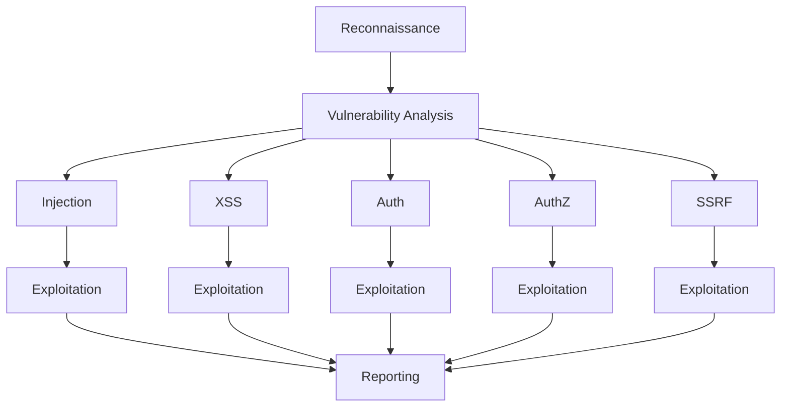

## Shannon is your fully autonomous AI pentester

Shannon's job is simple: break your web app before anyone else does. The Red Team to your vibe-coding Blue team. Every Claude (coder) deserves their Shannon.

<Note>
  **Shannon Lite achieves a 96.15% success rate** on a hint-free, source-aware XBOW benchmark.
</Note>

## What is Shannon?

Shannon is an AI pentester that delivers actual exploits, not just alerts.

Shannon's goal is to break your web app before someone else does. It autonomously hunts for attack vectors in your code, then uses its built-in browser to execute real exploits, such as injection attacks, and auth bypass, to prove the vulnerability is actually exploitable.

### What problem does Shannon solve?

Thanks to tools like Claude Code and Cursor, your team ships code non-stop. But your penetration test? That happens once a year. This creates a massive security gap. For the other 364 days, you could be unknowingly shipping vulnerabilities to production.

Shannon closes this gap by acting as your on-demand whitebox pentester. It doesn't just find potential issues. It executes real exploits, providing concrete proof of vulnerabilities. This lets you ship with confidence, knowing every build can be secured.

<Info>
  Shannon is a core component of the **Keygraph Security and Compliance Platform**. While Shannon automates the critical task of penetration testing for your application, the broader platform automates your entire compliance journey—from evidence collection to audit readiness.
</Info>

## Key features

<CardGroup cols={2}>
  <Card title="Fully autonomous operation" icon="robot">
    Launch the pentest with a single command. The AI handles everything from advanced 2FA/TOTP logins (including sign in with Google) and browser navigation to the final report with zero intervention.
  </Card>
  
  <Card title="Pentester-grade reports" icon="file-shield">
    Delivers a final report focused on proven, exploitable findings, complete with copy-and-paste Proof-of-Concepts to eliminate false positives and provide actionable results.
  </Card>
  
  <Card title="Critical OWASP coverage" icon="shield-check">
    Currently identifies and validates the following critical vulnerabilities: Injection, XSS, SSRF, and Broken Authentication/Authorization, with more types in development.
  </Card>
  
  <Card title="Code-aware dynamic testing" icon="code">
    Analyzes your source code to intelligently guide its attack strategy, then performs live, browser and command line based exploits on the running application to confirm real-world risk.
  </Card>
  
  <Card title="Integrated security tools" icon="wrench">
    Enhances its discovery phase by leveraging leading reconnaissance and testing tools—including Nmap, Subfinder, WhatWeb, and Schemathesis—for deep analysis of the target environment.
  </Card>
  
  <Card title="Parallel processing" icon="bolt">
    Get your report faster. The system parallelizes the most time-intensive phases, running analysis and exploitation for all vulnerability types concurrently.
  </Card>
</CardGroup>

## Real results

Shannon discovered 20+ critical vulnerabilities in OWASP Juice Shop, including complete auth bypass and database exfiltration.

<CardGroup cols={3}>
  <Card title="OWASP Juice Shop" icon="droplet" href="/examples/juice-shop">
    20+ high-impact vulnerabilities including complete authentication bypass and database exfiltration
  </Card>
  
  <Card title="c{api}tal API" icon="plug" href="/examples/capital-api">
    15+ critical vulnerabilities leading to full application compromise
  </Card>
  
  <Card title="OWASP crAPI" icon="car" href="/examples/crapi">
    15+ critical vulnerabilities achieving full database compromise via advanced JWT attacks
  </Card>
</CardGroup>

## Product editions

Shannon is available in two editions:

| Edition | License | Best For |
|---------|---------|----------|
| **Shannon Lite** | AGPL-3.0 | Security teams, independent researchers, testing your own applications |
| **Shannon Pro** | Commercial | Enterprises requiring advanced features, CI/CD integration, and dedicated support |

<Warning>
  **White-box only.** Shannon Lite is designed for **white-box (source-available)** application security testing. It expects access to your application's source code and repository layout.
</Warning>

## Get started

<CardGroup cols={2}>
  <Card title="Quickstart" icon="rocket" href="/quickstart">
    Get Shannon running and execute your first pentest in minutes
  </Card>
  
  <Card title="Installation" icon="download" href="/installation">
    Detailed installation instructions and platform-specific setup
  </Card>
  
  <Card title="Configuration" icon="gear" href="/guides/configuration">
    Configure authentication, 2FA, and custom testing parameters
  </Card>
  
  <Card title="Architecture" icon="diagram-project" href="/concepts/architecture">
    Learn how Shannon's multi-agent system works under the hood
  </Card>
</CardGroup>

## How Shannon works

Shannon emulates a human penetration tester's methodology using a sophisticated multi-agent architecture:

### Five-phase pipeline

<Steps>
  <Step title="Pre-Reconnaissance">
    External scans (nmap, subfinder, whatweb) + source code analysis
  </Step>
  
  <Step title="Reconnaissance">
    Attack surface mapping from initial findings
  </Step>
  
  <Step title="Vulnerability analysis">
    5 parallel agents hunt for injection, XSS, auth, authz, and SSRF vulnerabilities
  </Step>
  
  <Step title="Exploitation">
    5 parallel agents execute real exploits to confirm vulnerabilities
  </Step>
  
  <Step title="Reporting">
    Executive-level security report with reproducible proof-of-concepts
  </Step>
</Steps>

<Info>
  Shannon enforces a strict **"No Exploit, No Report"** policy. If a hypothesis cannot be successfully exploited to demonstrate impact, it is discarded as a false positive.
</Info>

## Community and support

<CardGroup cols={3}>
  <Card title="Discord" icon="discord" href="https://discord.gg/KAqzSHHpRt">
    Join the community for real-time support
  </Card>
  
  <Card title="GitHub Issues" icon="github" href="https://github.com/KeygraphHQ/shannon/issues">
    Report bugs and request features
  </Card>
  
  <Card title="Documentation" icon="book" href="https://keygraph.io">
    Explore the full Keygraph platform
  </Card>
</CardGroup>